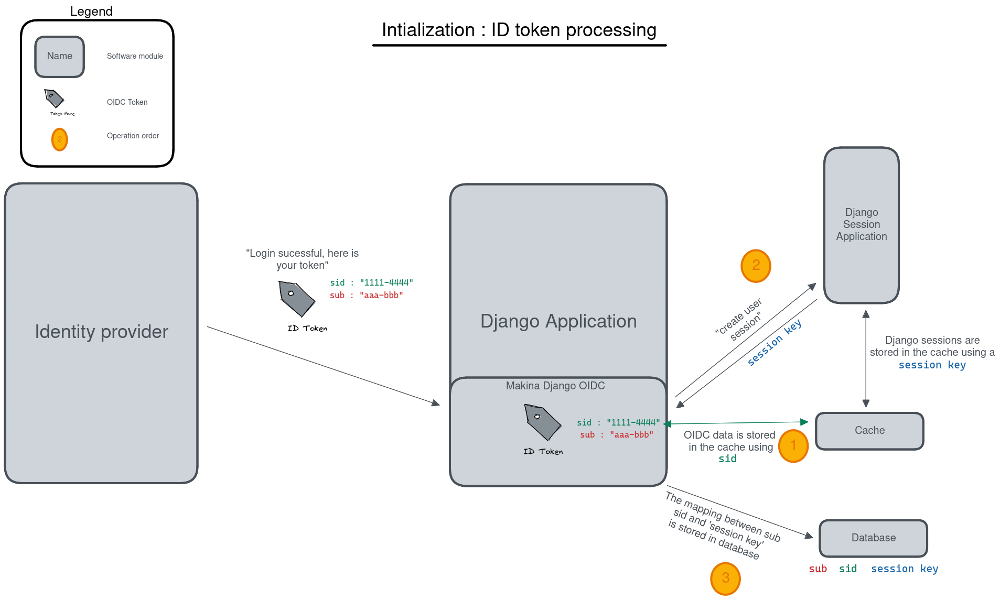
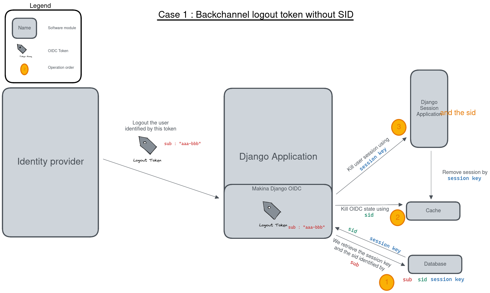
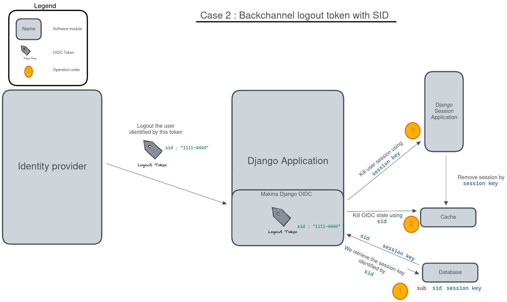

Why make a new OIDC library ?
=============================

We decided to role our own OIDC integration with Django, and that is not a small work. As such we first performed an analysis of the existing libraries, evaluating whether or not we should contribute to them or implement our own.

In this section you will find the results of this analysis. We collected our data during the first months of 2023.

Here are our criteria :

* do you need a custom authentication backend to work ? Our use case includes multi-tenant setup through `django-siteprefs <https://pypi.org/project/django-siteprefs/>`_
* is security sensitive code based on a well known, well maintained library ?
* is it still maintained ?
* does it supports *Bearer* authentication (for ``django-rest-framework``).

`django-allauth <https://github.com/pennersr/django-allauth/>`_
~~~~~~~~~~~~~~~~~~~~~~~~~~~~~~~~~~~~~~~~~~~~~~~~~~~~~~~~~~~~~~~

**Todo**

`django-auth-oidc <https://gitlab.com/aiakos/django-auth-oidc>`_
~~~~~~~~~~~~~~~~~~~~~~~~~~~~~~~~~~~~~~~~~~~~~~~~~~~~~~~~~~~~~~~~

**Advantages** :

- Goes well with `django-siteprefs <https://pypi.org/project/django-siteprefs/>`_
- Nice hook system that is very very flexible and works well

**Drawbacks** :

- The OIDC implementation is based on a custom lib `python-openid-connect <https://gitlab.com/aiakos/python-openid-connect>`_ (which is itself based on ``jose``)
- No *Bearer* authentication

`dj-authentication <https://gitlab.com/aiakos/dj-authentication/>`_
~~~~~~~~~~~~~~~~~~~~~~~~~~~~~~~~~~~~~~~~~~~~~~~~~~~~~~~~~~~~~~~~~~~

This library is based on ``django-auth-oidc`` and adds some glue to allow more features.

**Advantages** :

- Modular architecture which is very flexible
- Does support *bearer* and *confidential* clients

**Drawbacks**

- Still a homemade OIDC implementation

`mozilla-django-oidc <https://github.com/mozilla/mozilla-django-oidc/>`_
~~~~~~~~~~~~~~~~~~~~~~~~~~~~~~~~~~~~~~~~~~~~~~~~~~~~~~~~~~~~~~~~~~~~~~~~

**Advantages**

- Does support *confidential* and *bearer* modes
- This library has good usage among Django projects

**Drawbacks**

- It seems that adding OIDC features will be complicated as they seem to want to keep their library *"as minimal/lightweight as possible"*
- The project seems dead ?

`django-oidc <https://github.com/py-pa/django-oidc>`_
~~~~~~~~~~~~~~~~~~~~~~~~~~~~~~~~~~~~~~~~~~~~~~~~~~~~~

**Advantages**

- This library is based on `pyoidc <https://github.com/CZ-NIC/pyoidc>`_ which is a strong implementation of OIDC
- It handles very well all kinds of login flow( *Authorization Code flow*, *Implicit flow* and *Hybrid flow*)

**Drawbacks**

- Very old and unmaintained
 
`Django OAuth Toolkit <https://github.com/jazzband/django-oauth-toolkit>`_
~~~~~~~~~~~~~~~~~~~~~~~~~~~~~~~~~~~~~~~~~~~~~~~~~~~~~~~~~~~~~~~~~~~~~~~~~~~

**Advantages**

- This is what seems to be the most used library of the Django ecosystem
- It is stable and maintained, quite certainly robust
- `<OIDC support documentation https://django-oauth-toolkit.readthedocs.io/en/latest/oidc.html>`_

**Drawbacks**

- It's not only an oidc client, it can act as a server, and do other work on the oauth2 scope, not just oidc (which is a specialization of oauth2 for SSO).
- Documentation (which needs to covers also the *server* part) is not easy to use for an *simple* oidc client integration

This Project Goals
==================

This project aim to make OIDC client integration with Django easier while still being robust, expandable and flexible.
To reach this goal we wanted a project with:

- good documentations, based on use cases and helping users doing the right things in the quite complex OIDC world
- robust security components (handling the cryptography and security aspects of OIDC)
- more real world usage than the too simple 'handle OIDC login' examples (like API modes, logouts, asynchronous logouts, MtoM mode, multi-tenant setup, etc.)

Handling the 'login' part in OIDC is quite easy, on the client side. And this part is usually managed by a library (like pyoidc for example).

Direct Logout and Asynchronous logouts are more complex to understand and manage. The next section is a deeper explanation on this subject.

MtoM mode is about Machine-To-Machine communication, like B-to-B, the fact that your application may need to use OIDC not only to handle real
(human) users sessions, but also maybe connections made by some other applications, or you may also need to perform such operation (connecting
a remote web service using OIDC, not using an human account but a service account instead, identifying as an application and not as a human).

The multi-tenant feature means handling several OIDC providers, it is not uncommon to allow several identity providers on your login page.
A good OIDC client should facilitate the configuration mechanisms for handling several very different OIDC connectors. Using both a
classical web application (generating HTML pages) and a REST API on the same Django application could also be managed with different OIDC credentials,
and the OIDC client configuration should let you use différent credentials on theses applications sections with ease.

OIDC Logouts
------------

Using a SSO: now there's another session
~~~~~~~~~~~~~~~~~~~~~~~~~~~~~~~~~~~~~~~~

When you start using a SSO you should know that this SSO comes with a SSO session. That's an user session stored on the SSO.
This session can be associated with several applications (clients in OIDC terms). When you redirect the user to the SSO you
are in fact asking the SSO to check if the user has already started a SSO session, or asking for the creation of a new one.

This *'connection'* phase with the SSO was the easy part.

The *'logout'* phase is more complex as they are now several use cases, and if you never used a SSO before you may think that
login out is simple and mean simply destroying your application session.

In a *'classical'* web application, without the SSO you have two cases:

* You just have an API backend, there is no real *'session'*, you receive the use information from a JWT in API calls (or an
  equivalent).
* You have a more classical *'full stack'* web application, or API, with a cookie based session.

In the first case there's no '*logout'* work on the API side. And this will always be the case, that's not something managed by
your backend.
For cookie based session login out is quite easy, you invalidate the cookie (usually by sending back a new version of this cookie
to the user, but simply destroying the cookie on your side is enough to make this session invalid).

Now, using OIDC, if you simply drop your application cookie you have a **big problem**. Your application may even show the user
a disconnect confirmation page, and maybe a new login page with several options (local login, SSO login ,etc.). But if the user
click on the SSO login option and nothing was done bout the SSO session, the user still have a valid SSO session and the **SSO 
will automatically** connect back the user to your application.

The **first** thing to note is that disconnecting from your application now **requires** also disconnecting from the SSO session.
If you forget this point the user will be automatically reconnected to your application (it may be instantaneous or via a
'connect using SSO button trigger' depending on the way you link with the SSO). This first case is the **Direct Logout** case,
the user is on your application and wants to disconnect.

As you can guess there's another case. The SSO session may only be associated with your application, and that's usually the case
in development phase, which makes this second case harder to guess. This SSO session may also be associated with several
applications (other clients). This fact introduces a new use case:

* **The user is currently connected to the other application and disconnects from there**

This second application is correctly made and the user disconnection from this second application triggers the SSO session termination.
What does it mean fro your application? You have created a local session, based on a valid SSO session, and this SSO session is now
ended. Your local application session should also be invalidated soon.

This use case has **three** solutions. It also has a very common wrong *solution* which is far too widespread, and that is to ignore the
remote ending of the SSO session and keep the local session active for several hours despite the fact the user has disconnect from
the SSO. The problem here is that from the user point of view, he may share his browser with someone else, make a new connection
with another user in one of the client application, then visit your application and be associated with the wrong user on your website
(you still have a valid session based cookie for another user).

* **One** solution is to keep track of the **access_token short lifetime** you received when creating your local Django session.
  This time validity is quite certainly shorter than your Django session lifetime. Then you can add a regular check of this access_token
  lifetime and have Django **regularly and transparently asking the SSO for a new access token** when this access token is end-of-life.
  This is made using the refresh token which has a longer lifetime. Now if the SSO session has been terminated, the next time you'll try
  to transparently get a new access_token it will fail, and your OIDC client can decide to destroy the local Django session in that case.
  This solution is almost OK, you may still have some problems while the previous access token is still valid, and depending on the
  lifetime of access token it can be for 5, 10 or 15 minutes. This SSO connection **'refreshing'** is implemented in this library, and
  already ensure the minimum indirect SSO disconnect support.
* the **second** and **third** solutions are managed by the SSO server (and your application), they are called **Back-channel logout**
  and **Front-channel logout**. Not all SSO servers implements theses things, and usually not both.

We'll detail these two solutions and the way to use it with this library in the next parts, but to give you a summary the goal here is
that when the user disconnects from another client we want the SSO to be able to reach you and ask your application to logout the user
(to destroy your local session). The **Front-channel** logout will try to reach you by using browser redirects, sending the user to
a special page on your Django. The **Back-Channel** logout will not use the user browser, the SSO server will directly send an HTTP
request to your website, asking for a specific user logout.

Note: in case of *bearer-only* API mode, where you do not manage a local user session, the logout phase does not exists for you, so
you have nothing to handle.

Direct logout
~~~~~~~~~~~~~

OIDC specification : https://openid.net/specs/openid-connect-rpinitiated-1_0.html

The direct logout is the first use case, the *simple* one. The active SSO user is currently on your Django managed website,
he wants to disconnect.

The OIDC library must be connected to this disconnect action, because two things must be done:
* destroy the local user session
* send a special redirect link to the SSO disconnection page

Here several things may happen for the user experience, depending on the SSO server and the arguments supported and used on
this disconnection link.

* Maybe the SSO server will show a disconnect confirmation page to the user.
* Maybe we can send the SSO server a final redirect link for a page where the user should be redirected after the logout will
  be done (Note that the SSO server may apply some restrictions on the allowed URI for the redirect link).
* Maybe we have to send some special arguments on this redirect link.

As an example, old version of Keycloak SSO server used disconnect links looking like: ::

/auth/realms/<realm>/protocol/openid-connect/logout?redirect_uri=<a valid redirect uri>

Starting version 17 the id_token_hint arguments became mandatory (else a disconnect confirmation page is shown)
and some arguments are reworded.::

/realms/<realm>/protocol/openid-connect/logout?post_logout_redirect_uri=<a valid redirect uri>&id_token_hint=<a valid user token>

So finding the right syntax for the direct logout link may require some tests, be sure to validate that the library is generating the right type of
logout link, you should have several settings available to alter this link. Various parameters can be added on this logout link like the user locale or the current client_id.

On this library, to use a direct SSO logout you need to use the ``OIDCLogoutView``, by default it is connected to ``<module route prefix if any>/logout``.
This view will destroy the local Django session and the local OIDC session elements, and then generates a browser redirect to the SSO server logout url.
You can extend this view by defining a **HOOK_USER_LOGOUT** which runs just before these deletions and redirects.

Back-channel logout
~~~~~~~~~~~~~~~~~~~

OIDC specification : https://openid.net/specs/openid-connect-backchannel-1_0.html

The **SSO Server client configuration** for your application will need to know the Back-Channel url on your Django application, this url
is by default **``<absolute url of your website>/<url prefix for this module if any>/back_channel_logout/``**.

You **must** ensure that your client's settings on the SSO server have the back-channel logout activated and set on this special URL.

The Back Channel logout is a direct HTTP communication coming from the SSO server to your website. It does not imply the user browser.

This means it cannot use the user cookies, and that means you cannot rely on the classical Django session to detect the *active* user.

Your Django websites needs a routed url that can be reached directly by the SSO server, the routed action will manage the incoming SSO
server request. As stated above the default url is **``<absolute url of your website>/<url prefix for this module if any>/back_channel_logout/``**.

This backchannel logout action is a special POST request which does not contain any potential csrf token. You receive a POST without showing any form.
One of the first thing to ensure is that receiving a POST on this route without the anti-csrf validation will not be blocked, and for that this
library use the ``csrf_exempt`` tag on the ``OIDCBackChannelLogoutView``.

The body of this POST request is a JWT (which must be validated, of course), inside this JWT the **key** used to find which local user
session should be destroyed is the ``sid`` claim or the ``sub`` claim.

This ``sid`` is a key which was already present in all the tokens we received before from the SSO, that's the SSO **session
identifier** for this user. (Note: Only Identity Provider implementing session management might send this sid, so it's not always present).

The ``sub`` claim is the ``Subject identifier``, something which **uniquely identify the user** on the SSO server.
You can have both ``sub`` or ``sid`` or at least one of them. And the OIDC specification states that if you do
not have the ``sid`` session identifier it means that all sessions of the ``sub`` user should be removed.

To be able to destroy the user session based on this ``sid`` or ``sub`` we have to ensure that we can find back any local Django session
by theses identifiers, which are not the Django session identifier.
This is the main reason of having an ``OIDCSession`` model managed by this library, it can be used to find and destroy all sessions
associated with a ``sub`` identifier or for the ``sid`` search in the session_state attribute of this model. Check also the exaplanations
on **cache management** below.

If you can use the Backchannel logout, i.e. it is supported by the SSO server and you can transmits the right url to use to get a working
configuration for your client on this SSO server, then **you should try to use it instead of Front-Channel logout**, it is **more reliable**
as Front Channel Logout implementations may suffers from cross origin iframe restrictions on browsers or bad third party applications blocking
chained logouts. A Back-Channel Logout will never be blocked by a browser security setting as it does not use the browser.

Front-channel logout
~~~~~~~~~~~~~~~~~~~~

OIDC specification : https://openid.net/specs/openid-connect-frontchannel-1_0.html

**Not Implemented : this documentation for front channel logout refers to a future feature.** As Keycloak server does not implement front channel
logout we did not implement it yet. This implementation will occurs as soon as we find a reliable way to test it.

As stated above the front channel logout is less reliable than the Back Channel logout, but you may only have this option
available on the SSO server configuration side.

The front channel logout is made by chaining redirects on the user browser (or using a page with several iframes, each one targeting a client),
the SSO server will try to reach all active clients on the user SSO session, each one a special logout page, and get all local sessions destroyed
with that.

* This special logout page must not be the logout page which redirects to the SSO, the goal is to destroy the local session only
* Chaining the redirects is hard, if one of the other applications reached in this chain is badly implemented the redirect 
  loop may not reach you (stuck on this other application, usually on a 404), and you cannot disconnect the user. That's why iframes are better.
  But it may interfere with combined protocols logouts (front channel SAML logouts and then OIDC logouts for example)
* iframes may not be very reliable with increasing browser third party access security.

The **SSO Server client configuration** for your application will need to know the Front-Channel url on your Django application, this url
is by default **``<absolute url of your website>/<url prefix for this module if any>/front_channel_logout/``**.

You **must** ensure that your client settings on the SSO server have the front-channel logout activated and set on this special URL.

This logout url will simply get reached by a GET HTTP request (not a POST like in the Back-Channel logout).

The work that should be done on Django is to remove the active session, note that if you played with Html5 storage on the browser you
should extend this library to also include Html5Storage cleanup on disconnect. As we get a regular browser request we should already
have automatically the current active user session loaded and simply end it. If the current user session is not active nothing should
be done. This means that we should maybe not even generate a redirect to the SSO login page or the application login page.

This logout request may have some optional ``sid`` (SSO session identifier) and ``iss`` (SSO Server issuing the request) claims.
We are not required to use these attributes to decide whether or not the current session should be terminated.
We could simply terminate the current active user session. But we can use these claims to check that the current user session matches
the claims. The default behavior of this library should be to check the claims if they are provided, maybe with a setting to alter this behavior

Note: if your Django acts as an OIDC SSO server for other applications, receiving a front channel logout call should generate a page
containing an iframe with front channel logouts links for all the client applications of your Django. In this library we consider the
Django website to be only an OIDC client (not server) and we did not implement this cascading front channel logout specification.

About caching
=============

This library depends on **Django cache system**. Why do an OIDC client depends on a cache ?

The OIDC protocol has a lot of states (as several messages are exchanged and some elements are send back to validate that the response
goes with your request, or that no one tried to *replay* the exchange) and also needs to store external elements (think of public cryptographic
keys used to verify the tokens signatures for example).

As such we serialize OIDC state to the cache upon each operation (start login, complete login, etc.).

However, to implement logout (and more specifically back-channel logout) we need to be able to link session keys used by the django
session framework, and oidc session identifiers  (``sid`` and ``sub`` since it can also replace session identifiers in the specification).
This data is stored in a database table.

