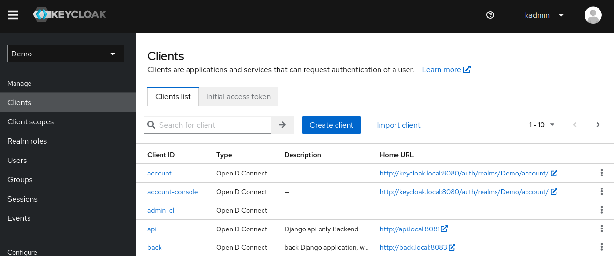
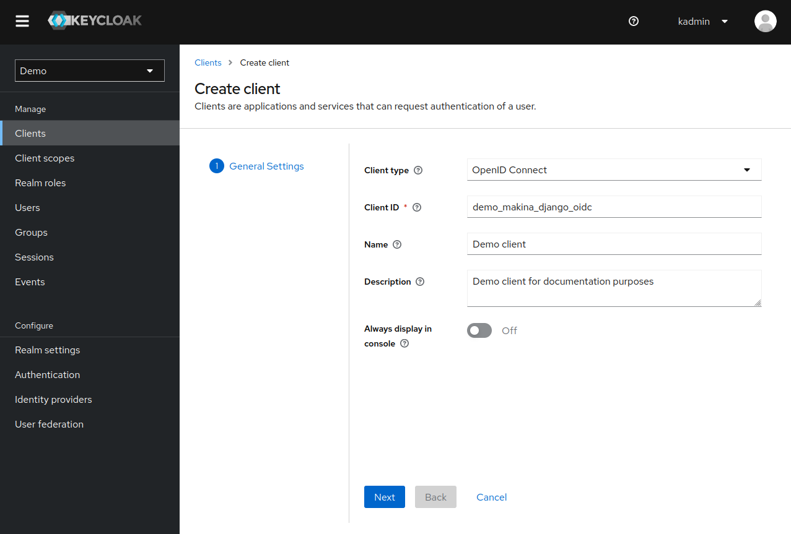
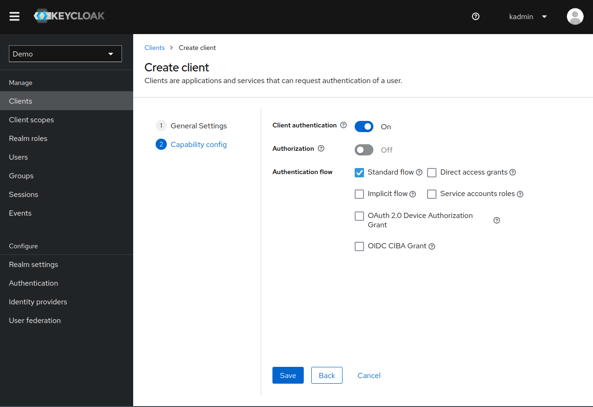
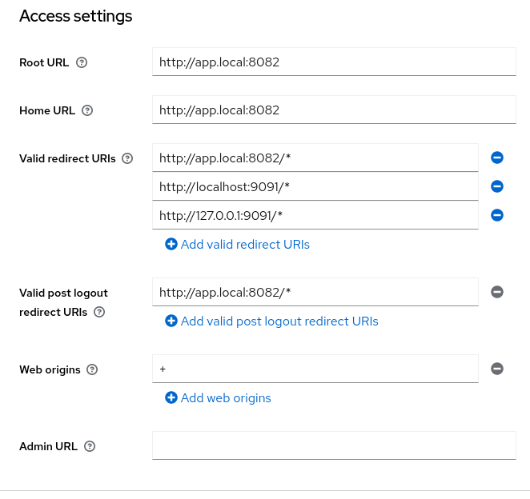
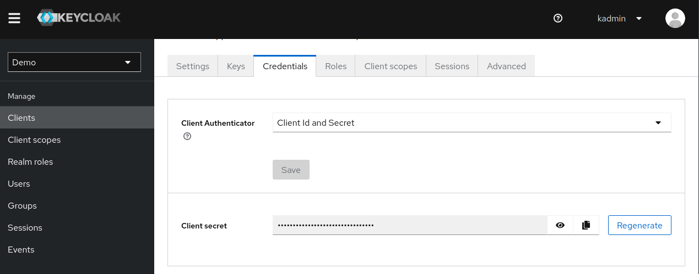

Connecting a django project to an identity provider
===================================================

In this tutorial, you will learn how to use this library along with an identity provider (IP) to setup
a single-sign-on system. For the purpose of this tutorial, we will use Keycloak as an IP.

Requirements
~~~~~~~~~~~~

To use this library, make sure that you meet the following requirements :

- ``django>=4.2``
- ``python>=3.8``
- the `Session middleware <https://docs.djangoproject.com/en/5.1/ref/middleware/#module-django.contrib.sessions.middleware>`_ is enabled
- a cache backend for django (redis, etc.)
- an OIDC-compliant identity provider

Installation
~~~~~~~~~~~~

To install this library the easiest way is to use the pypi package

::

  pip install django-pyoidc

Configuring your SSO
~~~~~~~~~~~~~~~~~~~~

Next, you should configure a client in your identity provider configuration interface.

.. warning::
    Incorrect configuration of your Identity Provider can create security issues. Please make sure you understand the values you input
    and their impact on the security level of your system.

We provide instructions for `Keycloak <https://www.keycloak.org/>`_ (version 18 and more), a free and open source Identity Provider maintened by Red Hat.

Keycloak
********

Start by connecting as your realm admin on the administration interface.

We will create a new client which supports the 'Authorization Code Flow'. Go to the client list of your realm and click on *"Create client"*

Set the ``Client type`` to *OpenID Connect* and choose a meaningful ``Client ID``. The other options do not matter for this tutorial.

On the second page, enable ``Client authentication`` and the ``Standard Flow`` (also named *Authorization Code Flow* which is the one that we want).

Click on save and your client should be visible in the client list.

You can now configure your URLs. In the following example, the Django application is hosted at app.local:8082.

We configure our client URLs as such :

* ``Root URL`` and ``Home URL`` redirects to the root of our application *http://app.local:8082*
* With ``Valid redirect URIs`` we allow the user to be redirected to our application, or the one listening on ``localhost:9091`` and ``127.0.0.1:9091`` (for debug purposes)
* With ``Valid post logout redirect URIs`` the user can be redirected to our application after logout : *http://app.local:8082/**
* ``Web origins`` is set to *+* which allows (through CORS) all origins from the redirect URIs

TODO: using a 2nd app at localhost:9091 is confusing, remove that, use a localhost:something, better

Take note of your ``Client ID`` and visit the *Credentials Page* to find your ``Client Secret``. You will need both to configure the OIDC connector.

Finally, click on ``Realm Settings`` in the left menu, and scroll down to the *Endpoints* section. Copy the ``
OpenID Endpoint Configuration`` URL as you will need it later (this is the autodiscovery URL).

Congratulation, your Keycloak configuration is complete ! 🎉

Other Identity provider
***********************

Configuring your Django project
~~~~~~~~~~~~~~~~~~~~~~~~~~~~~~~

Install the application
***********************

It is now time to configure your Django project.

First, add the library app (``django-pyoidc``) to your django applications, after `django.contrib.sessions` and `django.contrib.auth` :

.. code-block:: python
    :caption: settings.py

    INSTALLED_APPS = [
        "django.contrib.auth",
        "django.contrib.sessions",
        ...
        "django-pyoidc"
    ]

.. warning::
    Do not forget later to run the **migrations** ! This module requires some extra database storage tables.

Configure a cache backend
*************************

**You must have a cache backend** for this library to work ! The OIDC protocol is very statefull and we use Django cache system to store data.
If you want to understand why, you can read the :ref:`Cache Management` page.

For the sake of this tutorial, you can use this cache management snippet (it should be pasted in your ``settings.py``) :

.. code-block:: python

    CACHES = {
        "default": {
            "BACKEND": "django.core.cache.backends.locmem.LocMemCache",
            "LOCATION": "unique-snowflake",
        }
    }

.. warning::
    Do not use those settings in production ! Go read the `django documentation <https://docs.djangoproject.com/en/stable/topics/cache/#setting-up-the-cache>`_ for more details.

Configure the library
*********************

First, make sure that the `Session middleware <https://docs.djangoproject.com/en/5.1/ref/middleware/#module-django.contrib.sessions.middleware>`_ is enabled.

We will use django_pyoidc provider system to generate the library configuration and views.

When using provider, you must provide 4 settings :

- the provider class to use
- the OIDC client ID : this is your identifier on the IP side (this is not a user account, this must be a *client* in the OIDC terminology)
- the OIDC client secret : this is your secret on the IP side
- the OIDC discovery URL : this url allows us to discover the various endpoint of the identity provider, easing the configuration

You must also define a provider name that will be used with other classes from this library. In the following
example, we define a provider named *sso* which uses ``Keycloak18Provider`` and fetches it's credential from
two environment variables :

.. code-block:: python
    :caption: settings.py

    DJANGO_PYOIDC = {
        # This is the name that your identity provider will have within the library
        "sso": {
            # change the following line to use your provider
            "provider_class": "django_pyoidc.providers.keycloak_18.Keycloak18Provider",

            # your secret should not be stored in settings.py, load them from an env variable
            "client_secret": os.getenv("SSO_CLIENT_SECRET"),
            "client_id": os.getenv("SSO_CLIENT_ID"),

            # Your autodiscovery url should go here
            "provider_discovery_uri": "https://keycloak.example.com/auth/realms/fixme",

            # This setting allow the library to cache the provider configuration auto-detected using
            # the `provider_discovery_uri` setting
            "oidc_cache_provider_metadata": True,
        },

When you need to configure a setting for your identity provider, it means that you have to update the  dictionnary in this setting. For example, if you were to configure ``oidc_paths_prefix`` for your Keycloak provider,  you would add ``oidc_paths_prefix : <your value>`` to the ``sso`` dictionnary.

Please note that ``drf`` is a reserved provider name (see :ref:`Configuring django_rest_framework` for more details)

Copy-paste this snippet to your ``settings.py``. Make sure to modify ``provider_discovery_uri``.

Generate the URLs
*****************

We provide a facility that generates all the views needed for a provider. This is implemented by the
``OIDCHelper`` class. This class reads the ``DJANGO_PYOIDC`` setting and uses it's configuration to
generate views.

To use it, you must instantiate it with ``op_name=<the name of your identity provider>``.

Here is how to do it for our tutorial :

.. code-block:: python
    :caption: urls.py

    from django_pyoidc.helper import OIDCHelper

    # `op_name` must be the name of your identity provider as used in the `DJANGO_PYOIDC` setting
    oidc_helper = OIDCHelper(op_name="sso")

    urlpatterns = [
        path(
            "auth/",
            include((oidc_helper.get_urlpatterns(), "django_pyoidc"), namespace="auth"),
        ),
    ]

This will create 4 views in your URL configuration. They all have a name that derives from the ``op_name`` that you used to create your provider.

* a :class:`login view <django_pyoidc.views.OIDCLoginView>` named ``<op_name>-login``, here handled on the ``/auth/login`` path
* a :class:`logout view <django_pyoidc.views.OIDCLogoutView>` named ``<op_name>-logout``, here handled on the ``/auth/logout`` path
* a :class:`callback view <django_pyoidc.views.OIDCCallbackView>` named ``<op_name>-callback``, here handled on the ``/auth/callback`` path
* a :class:`backchannel logout view <django_pyoidc.views.OIDCBackChannelLogoutView>` named ``<op_name>-backchannel-logout``, here handled on the ``/auth/backchannel-logout`` path

.. tip::

    You can override the naming behaviour by configuring the setting ``oidc_paths_prefix`` of your
    identity provider. The view names would then be ``<oidc_paths_prefix>_<view_name>``.

You should now be able to use the view names from this library to redirect the user to a login/logout page.

Configuring django_rest_framework
=================================

When using OIDC to authenticate an API, things are a little bit different than on a **full stack** website :

* we do not want to redirect users on login pages, or to manage logout
* we are receiving OIDC Bearer tokens -- access tokens-- (generated from other clients of the SSO) and the task is mainly to check that this token is valid and extract the user from it.

To configure *django_rest_framework*, you must create a special provider named ``drf``. The configuration
is similar to the one made in :ref:`Configure the library`.

.. code-block:: python
    :caption: settings.py

    DJANGO_PYOIDC = {
        # This is the name that your identity provider will have within the library
        "drf": {
            "provider_class": "django_pyoidc.providers.keycloak_18.Keycloak18Provider",
            "client_secret": os.getenv("SSO_CLIENT_SECRET"),
            "client_id": os.getenv("SSO_CLIENT_ID"),
            "provider_discovery_uri": os.getenv(
                "SSO_ENDPOINT", "https://keycloak.example.com/auth/realms/fixme"
            ),
            "oidc_cache_provider_metadata": True,
        },

.. note::
    Usually your application should request a different *client_id* for the apimode (like a **my-app-full** *client_id* for a confidential classical OIDC client and a **my-app-api** *client_id* for a bearer-only OIDC client in Keycloak). But if you have only one *client_id* it's OK to simply make a copy for the settings.

Once you declared those settings, you can configure ``DEFAULT_AUTHENTICATION_CLASSES`` to use ``django_pyoidc.drf.authentication.OIDCBearerAuthentication`` to use this authentication class on all your views :

.. code-block:: python
    :caption: settings.py

    REST_FRAMEWORK = {
        "DEFAULT_AUTHENTICATION_CLASSES": [
            "django_pyoidc.drf.authentication.OIDCBearerAuthentication"
        ]
    }

You can also set this class on a per-view basis using the ``authentication_classes`` attribute :

.. code-block:: python
    :caption: views.py

    from django_pyoidc.drf.authentication import OIDCBearerAuthentication

    class ExampleViewSet(ModelViewSet) :
        authentication_classes = [OIDCBearerAuthentication]

This class looks up the OIDC provider named ``drf`` in the ``DJANGO_PYOIDC`` setting. As such, you can only have one provider for all your API authentication, as you can not define
two ``drf`` keys in the settings.

.. tip::
    Look up `the drf documentation <https://www.django-rest-framework.org/api-guide/authentication/>`_ for more details about authentication classes.
